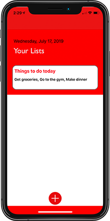
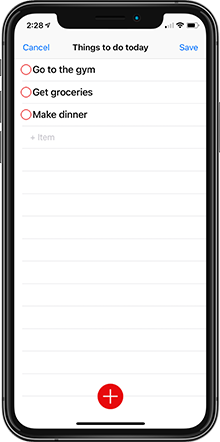
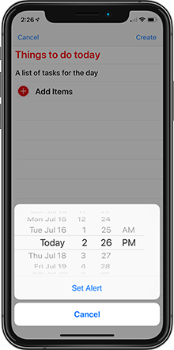

# Tasks
***
## Updates Coming In Version 2.0:
* adding NSPersistentCloudKitContainer to improve the Core Data/CloudKit Sync.
* Updated and simplified the User Interface in order to improve the User Experience.
* Added today and share extensions to improve User Experience.
* Added support for iOS 13.0 and Dark Mode!
***

## Description:
A to-do list application that syncs to-do's across all your iOS Devices. Add reminders for important tasks, For things you really can't forget you can add them to your calendar right from the app. This application is written in Swift 5.1.

***
## Technologies: 
* **UITableView:** Using UITableView for the list views in the project. 
* **UITabBarController:** TabBarController used to display menus to share or edit lists. 
* **Core Data:** Core Data used for local persistence. Save lists, tasks, reminders, and due dates all using Core Data.
* **CloudKit:** Used NSPersistentCloudKitContainer to perform Core Data/CloudKit Sync.
* **Today Extension:** Use the today widget to view any items that have a reminder date set for that day.
* **Share Extension:** Share tasks via share window.
* **Custom Animations:** Custom animations used on custom menus that appear and disappear from the TabBarController.  
* **Programatic UI:** Built the UI programatically without the use of Xib's or Storyboards.

***
## About This Project: 
- **Why did I make this?** I wanted a to-do list application that made it easier to stay on top of my tasks (don't we all?). I wanted the ability to add items to my calendar which would help me avoid snoozing items until I forgot about them. I also built this application to get a deeper dive into Core Data and CloudKit frameworks.  

- **What Did I Learn?** With this update I refactored almost the entire application to better reflect what I've learned as a developer since I first released Tasks. I focused on making the application adhere towards MVC. I also implemented a protocol for my database to abstract that functionality. Built a framework to hold my Core Data stack in order to provide Core Data access to both my today widget and my application.

- **What am I working on now?** I'm focusing on the UI currently to improve the look and feel of the application. While I'm not a designer myself, I'm trying to focus on the appearance. 

***
## Tasks Images
**Updated images coming soon! -- See below for current Tasks Images

### App Store:

#### **Updated version expected to be released to app store in early 2020!

***
## Requirements:
* iOS 13.0+
* Xcode 10+

***
## About The Developer:
I am an iOS Developer from Northern CA. I focus on writing applications in Swift and/or Objective-C. To learn more about me you can check out my [portfolio](https://dylanmccarthyios.com).

***
## *** Current Version Images ***
  

