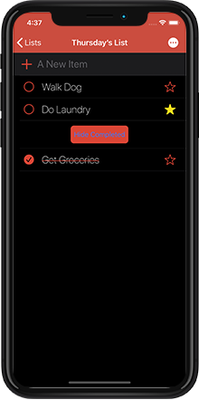

# Tasks
## Updates Available In Version 2.0:
* Added NSPersistentCloudKitContainer to improve Core Data/CloudKit Sync
* Updated and simplified User Interface to improve User Experience.
* Added Today Extension & Share Extension to improve User Experience.
* Added support for Dark Mode! Available in iOS 13 only.

***

 
## Description:
A To Do list application that sync's to-do's across all your iOS devices. Add reminders for important tasks and tasks you can't afford to forget can be added to your calendar right from the app. This application is written in Swift 5.1.
***
## Technologies: 
* **UITableView:** Using UITableView for the list views in the project. 
* **Core Data:** Core Data used for local persistence. Save lists, items, reminders, and due dates all using Core Data's FetchedResultsController.
* **CloudKit:** Used NSPersistentCloudKitContainer to perform Core Data/CloudKit Sync. This will save the beer you have selected as a favorite and make this data available on all your iOS devices!
* **Today Extension:** Use the today widget to view items that have a reminder set on that day. 
* **Share Extension:** Share tasks with others using the Share Extension widget.
* **Custom Animations:** Custom Animations used on Edit Item screen showing the reminder date picker inside the TableView. 
* **Programmatic UI:** Built the UI programatically without the use of Xib's or Storyboards.

***
## About This Project: 
- **Why did I make Tasks?** I wanted a to do list application that made it easier to stay on top of my tasks (don't we all?). I wanted the ability to add items to my calendar which would help me avoid 'snoozing' reminders until I forgot about them. I also wanted the chance to get a deeper dive into both the Core Data and CloudKit frameworks.

- **What have I learned so far?** With this update I refactored almost the entire applicationto better reflect what I've learned over the past year as a developer.
  * I have gained a greater understanding of planning out the app architecture and features from the beginning of the application. I also gained an understanding of the importance of abstraction and keeping code flexible to allow for changes/updates. 
  * I used programatic UI that helped me conform to MVC. 
  * Implemented a protocol for Core Data database functions to abstract the database functionality.
  * Used a framework to store my Core Data stack. Using the custom framework allowed me to access the Core Data in my Today Widget/Share Extension and the main application.
- **Whats Next?** 
  * Revising the code as the first round was to get the concept in front of the client to see what they liked/didn't like. 
  * Some UI Improvements and updates for iOS 13.

***
## Screenshots:
  

)
***
## Requirements:
* iOS 13.0+
* Xcode 10+
***
## About The Developer:
I am an iOS Developer from Northern CA. I focus on writing applications in Swift and Objective-C. To learn more about me, you can check out my [portfolio](https://dylanmccarthyios.com).
***

***
## Previous Version Screenshots:
  

