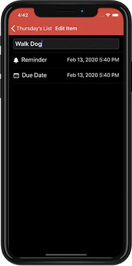

# Tasks

## Updates In Version 2.0:
* Added NSPersistentCloudKitContainer to improve the Core Data/CloudKit Sync.
* Updated and simplified the User Interface to improve the User Experience.
* Added today and share extensions to improve User Experience.
* Added support for iOS 13.0 and Dark Mode!
***
 
## Description:
A to-do list application that syncs to-do's across all your iOS Devices. Add reminders for important tasks, For things you really can't forget you can add them to your calendar right from the app. This application is written in Swift 5.1.

***
## Technologies: 
* **UITableView:** Using UITableView for the list views in the project. 
* **UITabBarController:** TabBarController used to display menus to share or edit lists. 
* **Core Data:** Core Data used for local persistence. Save lists, tasks, reminders, and due dates all using Core Data.
* **CloudKit:** Used NSPersistentCloudKitContainer to perform Core Data/CloudKit Sync.
* **Today Extension:** Use the today widget to view any items that have a reminder date set for that day.
* **Share Extension:** Share tasks via share window.
* **Custom Animations:** Custom animations used on custom menus that appear and disappear from the tab bar.  
* **Programatic UI:** Built the UI programatically without the use of Xib's or Storyboards.

***
## About This Project: 
- **Why did I make Tasks?** I wanted a to-do list application that made it easier to stay on top of my tasks (don't we all?). I wanted the ability to add items to my calendar which would help me avoid snoozing items until I forgot about them. I also built this application to become more familiar with both the Core Data and CloudKit frameworks.  

- **What have I learned so far?** With this update I refactored almost the entire application to better reflect what I've learned as a developer since I first released Tasks.
  * I have gained a greater understanding of planning out the App architecture and basic functionality from the start! 
  * I used programatic UI that helped me conform to MVC. 
  * Implemented a protocol for my Core Data database to abstract database functionality to the protocol. 
  Used a 
  * Moved my Core Data stack to a framework to access the stack from my main application and the today widget.

- **Whats Next?** 
  * Planning for adding some additional features to Tasks.
  * Continue to improve code.

***
## Screenshots:
    

***
## Requirements:
* iOS 13.0+
* Xcode 10+
***
## About The Developer:
I am an iOS Developer from Northern CA. I focus on writing applications in Swift and Objective-C. To learn more about me, you can check out my [portfolio](https://dylanmccarthyios.com).
***
## *** Previous Version Screenshots: ***
Some images of the previous version of Tasks. Version 2.0 is a great improvement in UI and Performance over the previous version. 
  

